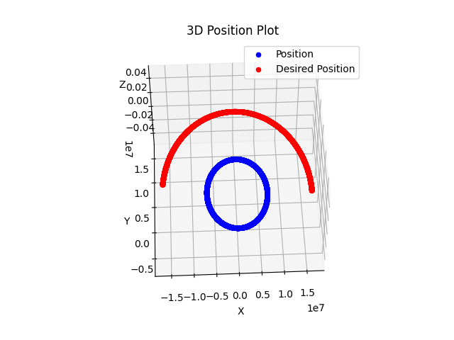

# fast_rendezvous

This is a C++ simulation of spaceflight dynamics for a satellite in low-earth orbit.
It will implement a control law for a time-optimal rendezvous with another satellite.

## Getting Started

In order to use this project locally, you must make sure you have cmake installed, as well as a working C++ compiler.
Additionally you will want to activate my additional bash file(s) to automate build, rebuild, and compile commands.

### Prerequisites

- CMAKE VERSION 3.25.2
- C++ compiler
- activate bash script(s) via terminal command: "chmod +x rebuild.sh" (as an example of one bash file)

### Installing

- Clone Git Repo
- check cmake version for compatability; run: "cmake --version"
- run command(s) to make bash script(s) executable (see above)

## Usage

- in root directory run ./rebuild.sh to build the project
- to output compiled program, run ./fast in the build directory (run cd build first)
- use post-processing script(s) for data analysis+visualization (in data_processing directory)
- Here is an example plot here of two circular orbits at very different altitudes.

## License

This project is licensed under the MIT License - see the [LICENSE.md](LICENSE.md) file for details.
